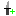
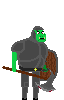
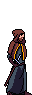
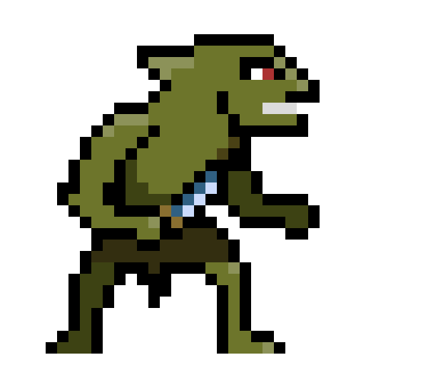
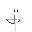
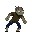

v1.0.0

# Gameplay

## Objective
Climb as far as you can without dtng

## Health
You start off with 5 hearts, equivalent to 100 hp. Each Quarter heart represents 5 hp.

You loose health if you are hit by an enemy, and you can gain health by collecting hearts scattered thoughout the tower or by purchasing an upgrade from the shop.

## Coins
| Coin | Name | Value |
| --- | --- |--- |
|  | Copper |  1 |
|  | Silver |  5 |
|    | Gold |  10 |

Coins can be spent at the shop

## Shop
Tap or Press F while hovering over the shop to open the menu. From there, you can purchase a max health increase, a full healing, a damage increase, and a speed increase. Each time you buy one the price increases.

|  | Description | 
| --- | --- |
|  | Increase Damage |
|  | Increase Movement Speed |
|    | Completely Heal Self |
|    | Increase Max Health |

The price for each buff increases each time you buy it. The prices scale with both the chosen class (see below) and the difficulty level.

## Main level
The tower is procedurally generated based off of many different pieces.

# Charactor Creator

| Name | | Description | Special Ability
| --- | --- | --- | --- |
| Fighter |  | Strong Melee, Slow Movement, High Health | Dash that can break wooden crates
| Rogue |  | Quick Movement, Average Health | Climbs Pipes |
| Wizard |  | Lower than average health, Average movement| Ranged Fireball Attack

# Enemies

| Name | | Description | 
| --- | --- | --- | 
| Goblin |  | Moves Quick, Lunge Attack|
| Skeleton |  | Ranged Attack |
| Slime |  | Slow Movement, Splits on Death|
| Zombie |  | Average Melee|

# Controls
- W to climb (for the rogue)
- A to move left
- S to move down (through platforms)
- D to move right
- SPACE to jump
- left click to attack
- right click to use the special ability 
- F to interact

On screen controls display instead on mobile, and (in the future) can be manually displayed in settings

# Credits
- Julia Abdel-Monem (UI/UX)
- Jason Culbertson (Enemies)
- Ferris Hammes-Buehler (Main Character)
- Taran Haug (Level Design)
- Gavin Haynes (Sound Design)

# Open Source License

This game uses Godot Engine, available under the following license:

Copyright (c) 2014-present Godot Engine contributors.
Copyright (c) 2007-2014 Juan Linietsky, Ariel Manzur.

Permission is hereby granted, free of charge, to any person obtaining a copy
of this software and associated documentation files (the "Software"), to deal
in the Software without restriction, including without limitation the rights
to use, copy, modify, merge, publish, distribute, sublicense, and/or sell
copies of the Software, and to permit persons to whom the Software is
furnished to do so, subject to the following conditions:

The above copyright notice and this permission notice shall be included in all
copies or substantial portions of the Software.

THE SOFTWARE IS PROVIDED "AS IS", WITHOUT WARRANTY OF ANY KIND, EXPRESS OR
IMPLIED, INCLUDING BUT NOT LIMITED TO THE WARRANTIES OF MERCHANTABILITY,
FITNESS FOR A PARTICULAR PURPOSE AND NONINFRINGEMENT. IN NO EVENT SHALL THE
AUTHORS OR COPYRIGHT HOLDERS BE LIABLE FOR ANY CLAIM, DAMAGES OR OTHER
LIABILITY, WHETHER IN AN ACTION OF CONTRACT, TORT OR OTHERWISE, ARISING FROM,
OUT OF OR IN CONNECTION WITH THE SOFTWARE OR THE USE OR OTHER DEALINGS IN THE
SOFTWARE.
